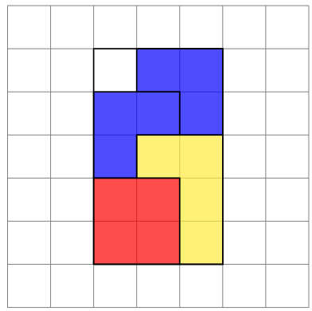

# polyomino packing

It is my solution to the problem of packing polyomino figures in a grid implemented with Python 3.

## Problem statement

> For the given rectangular-grid $T$ and  a given set of the reference rectangular polyominoes and L-polyominoes $P_i$  with given corresponding powers $N_i,$ find out whether a polyomino configuration with these parameters exists, which is a tiling of $T$.
> 

In simple words polyomino is a figure made up of cells: you should have seen them while playing Tetris. So the task is to write an algorithm which determines whether it is a possible to place all given figures to the grid of size of $H$ and $W$.

The problem statement defines two possible operations under the figures:

- parallel movement to the integer number of cells
- rotation centered at the origin by 90, 180 and 270 degrees

It is clear from the condition that the so-called one-sided polyominoes are meant in this problem. They are allowed to rotate in the plane, but they are not allowed to turn over.

For example, look at the picture below. There is a grid of size  $(3, 5)$ and the placed set of the polyomino: three L-polyomino and one rectangular polyomino. Polyomino can be encoded like that:

- $[ ((2, 2), 1)]$ — one rectangular polyomino with height equals 2 and width equals 2
- $[ ((3, 2), 1), ((2, 2), 2)]$ — two L-polyomino with size of $(2, 2)$ and one L-polyomino with size of $(3, 2)$



## Naive, but guaranteed solution

Obviously, it is possible to solve this problem applying brute-force technique: iterating over all possible figure placements. 

The set of all possible non-overlapping placements of figures $P_i,i \leq N$ on rectangle $T$ can be represented as a tree whose depth (provided that such placement exists) is $h$ equal to $N$. Thus, it is possible to realize a browse of all of all possible placement variants can be realized through a direct traversal of the tree. In other words, a modification of the backtracking algorithm can be applied here.

Below is an illustration of solving this task in the described way. Consider the placement of two L-polyominoes: $[((3, 2), 1), ((2, 2), 1)]$  on the grid of size  $(3, 5)$. To simplify the example, consider a variant of the problem in which the polyominoes can neither be rotated nor flipped.


Having started by placing the first figure on coordinate  $(0, 1)$, the algorithm cannot place the second figure from the list, so this branch is discarded and the algorithm moves to the next possible placement of the first figure: on coordinate $(0, 0)$. By this placement of the first figure, the second can be placed, for example, on $(1, 1)$. Since at this step the list of figures to be placed is over, the algorithm stops its work after finding the first possible solution to the problem.

## Applying of heuristics

Although this algorithm guarantees the finding of possible placement (or proves its nonexistence), generally it requires $O(n!)$ amount time even for comparatively small dimension of the input data.

For decrease of computing time it is necessary to find a way of pre-ordering variants of placements. The next ideas can serve as such a way, namely:

### Sorting the list of figures

Before you search for a placement for figures, you must sort them by decreasing area or perimeter (or by both).

### Cost function calculation

Since the task of the algorithm is to find the maximum dense arrangement of shapes relative to each other, the minimum value of the sum of coordinate values, which the shape will occupy at this arrangement, can be taken as the criterion of optimality of the arrangement.

This can be illustrated as follows (see the picture on the right).


At this step we consider two possible arrangements for L-polyomino of size (3, 2) relative to an already placed rectangular polyomino of size (2, 2).

The variant with a minimal sum of coordinates values is more preferable then others.

For example, “yellow” placement:

$(0 + 2) + (0+3)+(0+4)+(1+2) = 12$

and “green” one:

$(1+2)+(2+2)+(1+3) + (1+4) = 16$

Yellow variant is defined as the most preferable.

## The algorithm

The algorithm can be described as follows:

**Function of searching the best placement:**

$**findPossiblePlaces(figure, places)$:**

1. Init the list $possible\_places$
2. **for each** $place$ in $places$:
    1. place $figure$ в $(0, 0)$ , rotate and move it to   $place$
    2. **if** ($figure$ can be placed to the grid): add $place$ to$possible\_places$ with $cost(place)$
3. **sort** $possible\_places$ **in ascending order by cost**
4. **return**  $possible\_places$

**Polyomino packing algorithm:**

$packRecursively(figures, places)$:

1. **if** $length(figures)$ = 0: **return True**
2. **for each** $P_i$ **in** $figures$:
    1. $possible\_places$ = $findPossiblePlaces(figures, places)$
    2. **for each** $place$ **in** $possible\_places$:
        1. **if** $packRecursively(figures\space without\space P_i, places\space  without\space place)$
            1. **return True**
3. **return False**

## Estimation of the algorithm and pruning rules

In the best case, when each figure will be placed one after another sequentially, the complexity is estimated as $O(n^2 * log(n))$ (taking into account the fast sorting to find the lowest cost next placement position).

The worst case was described above: if no valid polyomino tiling exists, it takes a total of $O(n!)$  to try all variants.

As a possible additional measure to reduce the search variants, one can introduce additional pruning rules. As one such rule, we chose a heuristic restriction in which a branch is not considered further if it fails to recurrently place figures in descending order.

To explain this idea, consider the above example, adding another L-polyomino to the list of figures:$[((3, 2), 1), ((2, 2), 1)]$. It is impossible to place these figures on the grid of the same size, and if we apply the proposed rule, the graph will look as follows:


For implementing this rule it is necessary to add a new instruction:

**Polyomino packing algorithm:** $packRecursively(figures, places, pruning)$:

1. **if** $length(figures)$ = 0: **return True**
2. **for each** $P_i$ **in** $figures$:
    1. $possible\_places$ = $findPossiblePlaces(figures, places)$
    2. **for each** $place$ **in** $possible\_places$:
        1. **if** $packRecursively(figures\space without\space P_i, places\space  without\space place)$
            1. **return True**
    3. **if** $pruning$ **is True: return False**
3. **return False**

## Estimation of the consumed memory

The minimum set of used data structures:

- a 2d-array containing grid $T$
- a list containing $N$  polyomino
- a list  $possible\_places$

In the worst case (in which the dimension of the grid coincides or is close to $N$) each data structure requires $O(n)$ of the computer memory.

## Algorithm implementation

The suggested algorithm was implemented in Python 3.9

Main directory consists of four files:

- `recursive_packing.py` — main file which launches the packing algorithm.
- `polyomino.py` — file where abstract base class `Polyomino`  was defined with its inheritors: rectangular polyomino and L-polyomino.
- `utils.py` — file with utility functions such as checking validity of the placement
- `requirements.txt` — text file with a list of all necessary dependencies

## How to launch it

I added a command line interface as below:

```bash
usage: recursive_packing.py [-h] [-grid_height GRID_HEIGHT]
                            [-grid_width GRID_WIDTH] [-pruning_rule]
                            [-l_polyomino L_POLYOMINO [L_POLYOMINO ...]]
                            [-r_polyomino R_POLYOMINO [R_POLYOMINO ...]]

Packing polyomino in a grid

optional arguments:
  -h, --help            show this help message and exit
  -grid_height GRID_HEIGHT
  -grid_width GRID_WIDTH
  -pruning_rule         Boolean flag which defines the heuristic rule for
                        pruning branches of a graph
  -l_polyomino L_POLYOMINO [L_POLYOMINO ...]
                        Each L-polyomino described with triple of numbers:
                        length, ledge and number of instances
  -r_polyomino R_POLYOMINO [R_POLYOMINO ...]
                        Each rectangular polyomino described with triple of
                        numbers: width, height and number of instances
```

An example of the giving parameters with a pruning rule Boolean flag:

```bash
pack_polyomino.py -grid_height 4 -grid_width 4 -pruning_rule -l_polyomino 4 4 2 -r_polyomino 1 1 1
```

## Examples of working

Firstly I estimated elapsed time of searching with and without pruning:

**№1,  without pruning**

```bash
Pruning is DISABLED
---------------
A list of polyomino is given:
LP 1: size=(4, 4)
LP 2: size=(4, 4)
RP 3: size=(1, 1)
Length of the given list: 3
---------------
WIDTH = 4, HEIGHT = 4
Common area: 15
FAIL: Polyomino can NOT be packed to the grid.
---------------
Elapsed time: 0.551
```

**№1, with pruning**

```bash
Pruning is ENABLED
---------------
A list of polyomino is given:
LP 1: size=(4, 4)
LP 2: size=(4, 4)
RP 3: size=(1, 1)
Length of the given list: 3
---------------
WIDTH = 4, HEIGHT = 4
Common area: 15
FAIL: Polyomino can NOT be packed to the grid.
---------------
Elapsed time: 0.1
```

**№2, without pruning**

```bash
Pruning is DISABLED
---------------
A list of polyomino is given:
LP 1: size=(4, 4)
LP 2: size=(4, 4)
LP 3: size=(3, 3)
RP 4: size=(4, 4)
Length of the given list: 4
---------------
WIDTH = 6, HEIGHT = 6
Common area: 35
FAIL: Polyomino can NOT be packed to the grid.
---------------
Elapsed time: 82.377
```

**№2, with pruning**

```bash
Pruning is ENABLED
---------------
A list of polyomino is given:
LP 1: size=(4, 4)
LP 2: size=(4, 4)
LP 3: size=(3, 3)
RP 4: size=(4, 4)
Length of the given list: 4
---------------
WIDTH = 6, HEIGHT = 6
Common area: 35
FAIL: Polyomino can NOT be packed to the grid.
---------------
Elapsed time: 1.456
```

After successful searching the algorithm saves an image with possible placement of the figures.

**Example** **№1:**

- a grid with size of $(5, 5)$
- $[((3, 2), 2), ((2, 2), 1)]$ — L-polyomino
- $[((3, 2), 1), ((2, 1), 1)]$ — R-polyomino

**Example** **№2:**

- a grid with size of  $(5, 6)$
- $[((4, 2), 1), ((3, 2), 1), ((2, 2), 2)]$ — L-polyomino
- $[((3, 3), 1), ((2, 1), 1)]$ — R-polyomino

**Example** **№3:**

- a grid with size of  $(7, 6)$
- $[((4, 3), 3), ((3, 2), 1), ((2, 2), 1)]$ — L-polyomino
- $[((3, 3), 1), ((2, 1), 1)]$ — R-polyomino


